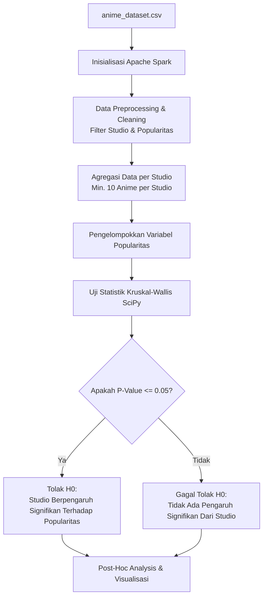

# 🎌 Analisis Pengaruh Studio terhadap Popularitas Anime menggunakan Apache Spark & SciPy (Kruskal-Wallis)

[](https://www.python.org/)
[](https://spark.apache.org/)
[](https://scipy.org/)
[](LICENSE)

Repositori ini berisi dokumentasi dan kode implementasi untuk menganalisis **pengaruh studio produksi terhadap tingkat popularitas anime**. Analisis ini dilakukan menggunakan dataset skala besar `anime-dataset.csv` dengan memanfaatkan kekuatan pemrosesan data terdistribusi dari **Apache Spark (PySpark)** dan pengujian statistik non-parametrik **Kruskal-Wallis** dari **SciPy**.

---

## 📌 Daftar Isi

1. [Penjelasan Analisis](#-penjelasan-analisis)
2. [Manfaat Analisis](#-manfaat-analisis)
3. [Tools yang Diperlukan](#-tools-yang-diperlukan)
4. [Langkah-langkah Melakukan Analisa](#-langkah-langkah-melakukan-analisa)
5. [Struktur Repositori](#-struktur-repositori)
6. [Panduan Kontribusi GitHub](#-panduan-kontribusi-github)
7. [Kontributor dan Tim Pengembang](#-kontributor-dan-tim-pengembang)

---

## 📖 Penjelasan Analisis

Popularitas suatu anime sering kali dikaitkan dengan studio yang memproduksinya (seperti _Ufotable_, _MAPPA_, _Studio Ghibli_, atau _Madhouse_). Namun, apakah reputasi studio secara statistik benar-benar memengaruhi tingkat popularitas anime secara signifikan, ataukah kepopuleran tersebut hanya didorong oleh faktor acak seperti genre atau kampanye pemasaran?

Untuk menjawab pertanyaan ini secara ilmiah, kami melakukan pengujian statistik menggunakan:

1. **Apache Spark (PySpark)**: Digunakan untuk memproses, membersihkan, dan mengagregasi data dari `anime-dataset.csv` secara efisien dan cepat (terutama jika data berukuran besar).
2. **SciPy (Kruskal-Wallis H-Test)**: Karena variabel popularitas biasanya berupa peringkat (_ranking_ atau skala ordinal) dan datanya tidak berdistribusi normal (non-parametrik), pengujian **Kruskal-Wallis** sangat tepat digunakan untuk membandingkan lebih dari dua kelompok independen (yaitu studio-studio anime).

### Alur Analisis Data



---

## 💡 Manfaat Analisis

Analisis ini memberikan berbagai dampak positif dan manfaat bagi berbagai pihak di industri kreatif:

- **Bagi Produser & Investor Anime**: Membantu mengambil keputusan strategis dalam memilih studio animasi mitra berdasarkan bukti data historis keberhasilan popularitas studio tersebut.
- **Bagi Analis Industri & Peneliti**: Memberikan metodologi ilmiah terukur untuk memetakan kekuatan pasar masing-masing studio anime dari waktu ke waktu.
- **Bagi Pengembang & Data Engineer**: Menjadi studi kasus nyata penerapan integrasi Big Data engine (Apache Spark) dengan pustaka komputasi ilmiah (SciPy) dalam satu alur kerja (_pipeline_) hibrida.

---

## 🛠️ Tools yang Diperlukan

Untuk menjalankan analisis ini di mesin lokal Anda, pastikan beberapa perangkat lunak berikut telah terinstal:

### Prerequisites

1. **Java Development Kit (JDK) 8 atau 11** (Wajib untuk menjalankan Apache Spark).
2. **Python 3.8 ke atas**.
3. **Apache Spark (3.x)** yang terkonfigurasi dengan variabel lingkungan (_environment variables_ `SPARK_HOME` dan `HADOOP_HOME` jika di Windows).

### Pustaka Python (Dependencies)

Instal seluruh dependensi Python dengan perintah di bawah ini:

```bash
pip install -r requirements.txt
```

Isi dari `requirements.txt` meliputi:

```text
openjdk>=17.0.2
Python>=3.10.6
pyspark>=4.1.2
scipy>=1.7.0
pandas>=1.3.0
scikit-learn>=1.8.0
matplotlib>=3.5.0
seaborn>=0.12.0
```

---

## 🚀 Langkah-langkah Melakukan Analisa

Berikut adalah panduan langkah demi langkah untuk mereproduksi analisis dari awal hingga akhir:

### Langkah 1: Import Libraries & Inisialisasi Mesin Spark

Import semua pustaka yang dibutuhkan, paksa PySpark menggunakan Python interpreter yang sama agar tidak terjadi error versi, lalu nyalakan Spark Session.

```python
import os
import sys
import itertools

import pandas as pd
import matplotlib.pyplot as plt
import seaborn as sns

from pyspark.sql import SparkSession
import pyspark.sql.functions as F
from pyspark.sql.types import (
    StructType, StructField,
    StringType, DoubleType, IntegerType
)
from scipy.stats import kruskal

# Paksa PySpark pakai Python interpreter yang sama dengan Jupyter
# Tanpa ini, PySpark bisa error karena pakai Python versi berbeda
os.environ['PYSPARK_PYTHON']        = sys.executable
os.environ['PYSPARK_DRIVER_PYTHON'] = sys.executable

print("=== Menyalakan Mesin Spark ===")

spark = SparkSession.builder \
    .appName("AnalisisPopularitasStudio") \
    .master("local[*]") \
    .config("spark.driver.memory",          "4g") \
    .config("spark.executor.memory",        "4g") \
    .config("spark.driver.maxResultSize",   "2g") \
    .config("spark.sql.shuffle.partitions", "8") \
    .getOrCreate()

spark.sparkContext.setLogLevel("WARN")
print("=== Mesin Spark Berhasil Dinyalakan ===")
```

### Langkah 2: Preprocessing Data

Baca dataset mentah, pilih kolom yang dibutuhkan, hapus missing value dan duplikat, lakukan encoding dan normalisasi, lalu tambahkan kolom `studios_name` ke dataset akhir.

```python
import pandas as pd

# Load data mentah dan pilih kolom yang dibutuhkan
data = pd.read_csv("../data/raw/anime_dataset.csv")
data = data[["title", "popularity", "favorites", "studios"]]
data.to_csv("../data/processed/anime_dataset_pre.csv", index=False)

# Tampilkan ringkasan awal dataset
print(data.head())
print(data.shape)
print(data.info())
print(data.describe())

# Hapus missing value
print(data.isnull().sum())
data = data.dropna()

# Hapus data duplikat
print(data.duplicated().sum())
data.drop_duplicates(inplace=True)

# Encode kolom studios (string → integer)
from sklearn.preprocessing import LabelEncoder
encoder = LabelEncoder()
data["studios"] = encoder.fit_transform(data["studios"])

# Normalisasi kolom popularity dan favorites ke rentang [0, 1]
from sklearn.preprocessing import MinMaxScaler
scaler = MinMaxScaler()
data[["popularity", "favorites"]] = scaler.fit_transform(data[["popularity", "favorites"]])

# Tambahkan kolom studios_name (nama asli studio) ke dataset preprocessed
data_pre = pd.read_csv("../data/processed/anime_dataset_pre.csv")
data = pd.read_csv("../data/processed/anime_dataset_pre2.csv")
data_pre["studios_name"] = data["studios"]
data_pre.to_csv("../data/processed/anime_dataset_pre.csv", index=False)
print("Selesai! Kolom 'studios_name' berhasil ditambahkan.")
```

### Langkah 3: Baca Data & Ekstraksi dengan PySpark

Baca dataset hasil preprocessing ke Spark dengan schema manual, kelompokkan popularitas per studio menggunakan satu query `groupBy` (jauh lebih efisien dari loop), lalu matikan Spark setelah data tersimpan di memori Python.

```python
path_data_bersih = "../data/processed/anime_dataset_pre.csv"

# Schema manual → Spark tidak scan file dua kali → hindari buffer error
schema = StructType([
    StructField("title",        StringType(),  True),
    StructField("popularity",   DoubleType(),  True),
    StructField("favorites",    DoubleType(),  True),
    StructField("studios",      IntegerType(), True),
    StructField("studios_name", StringType(),  True),
])

print("\n>>> Mengintip 5 data teratas hasil preprocessing:")
df = spark.read.csv(path_data_bersih, header=True, schema=schema)
df.show(5)

# Ambil daftar studio unik (untuk info)
daftar_studio = [
    row['studios'] for row in df.select('studios').distinct().collect()
    if row['studios'] is not None
]
print(f"Ditemukan {len(daftar_studio)} studio unik untuk dianalisis.")

# Kelompokkan popularitas per studio dalam SATU query — Spark hanya scan data sekali
hasil = (
    df.groupBy('studios', 'studios_name')
      .agg(
          F.collect_list('popularity').alias('skor_popularitas'),
          F.count('popularity').alias('jumlah')
      )
      .filter(F.col('jumlah') >= 10)   # hanya studio dengan minimal 10 anime
      .collect()
)

# Pisahkan hasil ke tiga list paralel — indeks ke-i selalu merujuk studio yang sama
kelompok_popularitas_full_population = [row['skor_popularitas'] for row in hasil]
groups_filtered_for_test             = [row['studios']          for row in hasil]
groups_name_for_label                = [row['studios_name']     for row in hasil]

# Matikan Spark — data sudah di memori Python, tidak dibutuhkan lagi
spark.stop()
print(f"\nBerhasil mengekstrak {len(groups_filtered_for_test)} studio untuk dianalisis.")
print("=== Proses PySpark Selesai. Masuk ke Pengujian SciPy ===")
```

### Langkah 4: Analisis Pandas & Uji Kruskal-Wallis

Konversi data ke long-format DataFrame, ambil Top 10 studio paling populer berdasarkan median, hitung statistik deskriptif, lalu jalankan uji Kruskal-Wallis.

```python
# Formulasi Hipotesis:
# H0: Distribusi tingkat popularitas anime sama di semua studio (Tidak ada pengaruh studio).
# H1: Setidaknya satu studio memiliki distribusi popularitas yang berbeda secara signifikan.

# TAHAP 1: Konversi ke Long-Format DataFrame
# itertools.chain.from_iterable "meratakan" list of list menjadi list tunggal
# zip() menjamin studios, studio_name, dan popularity selalu berpasangan dengan benar
df_viz_full = pd.DataFrame({
    'studios': list(itertools.chain.from_iterable(
        [sid] * len(scores)
        for sid, scores in zip(groups_filtered_for_test,
                               kelompok_popularitas_full_population)
    )),
    'studio_name': list(itertools.chain.from_iterable(
        [name] * len(scores)
        for name, scores in zip(groups_name_for_label,
                                kelompok_popularitas_full_population)
    )),
    'popularity': list(itertools.chain.from_iterable(
        kelompok_popularitas_full_population
    ))
})

# TAHAP 2: Ambil Top 10 studio paling populer
# "popularity" = skor rank → nilai KECIL = lebih populer
# ascending=True + head(10) → ambil 10 median terkecil = paling populer
top_10_ids = (
    df_viz_full.groupby('studios')['popularity']
               .median()
               .sort_values(ascending=True)
               .head(10)
               .index.tolist()
)

# Mapping ID → nama studio untuk label visualisasi
id_to_name = {
    sid: name for sid, name in
    zip(groups_filtered_for_test, groups_name_for_label)
}
category_order_named = [str(id_to_name.get(sid, sid)) for sid in top_10_ids]

# TAHAP 3: Hitung statistik deskriptif Top 10
top_10_summary_stats = (
    df_viz_full[df_viz_full['studios'].isin(top_10_ids)]
    .groupby('studios')
    .agg(
        N       =('popularity', 'count'),
        Median  =('popularity', 'median'),
        Mean    =('popularity', 'mean'),
        Std_Dev =('popularity', 'std')
    )
    .reindex(top_10_ids)   # urutkan sesuai top_10_ids (kecil ke besar)
    .reset_index()
)
# Tambahkan kolom nama studio ke summary stats
top_10_summary_stats['studio_name'] = top_10_summary_stats['studios'].map(id_to_name)

# TAHAP 4: Siapkan DataFrame & urutan kategori untuk visualisasi
df_viz_top10 = df_viz_full[df_viz_full['studios'].isin(top_10_ids)].copy()
df_viz_top10['studio_name'] = pd.Categorical(
    df_viz_top10['studio_name'],
    categories=category_order_named,
    ordered=True
)

# TAHAP 5: Uji Kruskal-Wallis — hanya pada Top 10
# Kruskal-Wallis menguji apakah >=1 studio punya distribusi popularitas berbeda
# H0: semua studio memiliki distribusi yang sama
# * unpacking (*) mengubah list of list menjadi argumen terpisah per studio
kelompok_top10 = [
    kelompok_popularitas_full_population[i]
    for i, sid in enumerate(groups_filtered_for_test)
    if sid in top_10_ids
]
h_stat, p_value = kruskal(*kelompok_top10)

print(f"Nilai H-Statistic : {h_stat:.4f}")
print(f"Nilai P-Value     : {p_value:.6f}")
```

### Langkah 5: Visualisasi Dashboard

Visualisasikan perbandingan distribusi popularitas studio-studio top menggunakan dashboard 4-panel yang terdiri dari Bar Chart, Box Plot, Strip Plot, dan Tabel Statistik.

```python
import seaborn as sns
import matplotlib.pyplot as plt

sns.set_theme(style="whitegrid", palette="muted")
fig, axes = plt.subplots(2, 2, figsize=(18, 13))
plt.subplots_adjust(hspace=0.45, wspace=0.3)

plt.suptitle(
    'Analisis Big Data Terdistribusi (PySpark) & Inferensial Non-Parametrik (SciPy)\n'
    'Dashboard Pengaruh Studio Produksi Terhadap Popularitas Anime',
    fontsize=16, fontweight='bold', color='#2c3e50'
)

# ── GRAFIK 1: Bar Chart Median ──────────────────────────────
ax1 = axes[0, 0]
sns.barplot(
    x='studio_name', y='Median',
    data=top_10_summary_stats,
    color='#5dade2', edgecolor='#34495e',
    ax=ax1, order=category_order_named
)
for container in ax1.containers:
    ax1.bar_label(container, fmt='%.4f', fontsize=8, padding=3)
ax1.set_title('GRAFIK 1: Ringkasan Komparatif Median Popularitas',
              fontsize=12, fontweight='bold', pad=10)
ax1.set_xlabel('Studio Produksi', fontsize=10)
ax1.set_ylabel('Median Skor Popularitas', fontsize=10)
ax1.tick_params(axis='x', rotation=30)

# ── GRAFIK 2: Box Plot ──────────────────────────────────────
ax2 = axes[0, 1]
sns.boxplot(
    x='studio_name', y='popularity',
    data=df_viz_top10,
    palette='Pastel1', ax=ax2,
    order=category_order_named,
    showfliers=True, width=0.6
)
medians = top_10_summary_stats.set_index('studio_name')['Median']
for i, studio in enumerate(category_order_named):
    median_val = medians[studio]
    ax2.text(i, median_val + 0.01, f'{median_val:.4f}',
             ha='center', va='bottom', fontsize=8, fontweight='bold', color='#2c3e50')
ax2.set_title('GRAFIK 2: Sebaran Distribusi Inferensial (Box Plot)',
              fontsize=12, fontweight='bold', pad=10)
ax2.set_xlabel('Studio Produksi', fontsize=10)
ax2.set_ylabel('Skor Popularitas', fontsize=10)
ax2.tick_params(axis='x', rotation=30)

# ── GRAFIK 3: Strip Plot + Median Line ─────────────────────
ax3 = axes[1, 0]
sns.stripplot(
    x='studio_name', y='popularity',
    data=df_viz_top10,
    palette='Dark2', ax=ax3,
    order=category_order_named,
    jitter=True, size=3, alpha=0.4
)
sns.boxplot(
    x='studio_name', y='popularity',
    data=df_viz_top10, ax=ax3,
    order=category_order_named,
    showfliers=False, showbox=False, showcaps=False,
    medianprops={"color": "black", "linewidth": 2.5}
)
for i, studio in enumerate(category_order_named):
    median_val = medians[studio]
    ax3.text(i, median_val + 0.01, f'{median_val:.4f}',
             ha='center', va='bottom', fontsize=8, fontweight='bold', color='black')
ax3.set_title('GRAFIK 3: Sebaran Data Mentah Individual (Strip Plot)',
              fontsize=12, fontweight='bold', pad=10)
ax3.set_xlabel('Studio Produksi', fontsize=10)
ax3.set_ylabel('Skor Popularitas', fontsize=10)
ax3.tick_params(axis='x', rotation=30)

# ── GRAFIK 4: Tabel Statistik & Keputusan ──────────────────
ax4 = axes[1, 1]
ax4.axis('off')

stats_text  = "=" * 62 + "\n"
stats_text += "       RINGKASAN STATISTIK DESKRIPTIF (TOP 10)          \n"
stats_text += "=" * 62 + "\n"
stats_text += f"{'Studio':<14}| {'N':<5}| {'Median':<8}| {'Mean':<8}| Std Dev\n"
stats_text += "-" * 62 + "\n"
for _, row in top_10_summary_stats.iterrows():
    nama = str(row['studio_name'])[:13]
    stats_text += (
        f"{nama:<14}| "
        f"{int(row['N']):<5}| "
        f"{row['Median']:<8.4f}| "
        f"{row['Mean']:<8.4f}| "
        f"{row['Std_Dev']:.4f}\n"
    )
stats_text += "\n" + "=" * 62 + "\n"
stats_text += "       HASIL UJI KRUSKAL-WALLIS (TOP 10 STUDIO)         \n"
stats_text += "=" * 62 + "\n"
stats_text += f"Nilai H-Statistic : {h_stat:.4f}\n"
stats_text += f"Nilai P-Value     : {p_value:.6f}\n"

decision_color = "green" if p_value < 0.05 else "red"
decision_text  = "SIGNIFIKAN (Tolak H0)"   if p_value < 0.05 \
            else "TIDAK SIGNIFIKAN (Terima H0)"

ax4.text(0.02, 0.98, stats_text,
         transform=ax4.transAxes, fontsize=9.5,
         fontfamily='monospace', va='top')

props = dict(boxstyle='round', facecolor=decision_color, alpha=0.3, edgecolor='black')
ax4.text(0.5, 0.04,
         f"Keputusan Statistik:\n{decision_text}",
         transform=ax4.transAxes, fontsize=12,
         fontweight='bold', color=decision_color,
         ha='center', bbox=props)

plt.tight_layout()
plt.show()
```

---

## 📁 Struktur Repositori

```text
anime-analisis/
├── .vscode                                 # setting json vs code
├── backup                                  # folder data cadangan
├── data                                    # folder kumpulan source dataset
|   ├── processed
|   |   └── dataset_preprocessing.csv       # dataset hasil preprocessing
|   └── raw
|       └── dataset_mentah.csv              # dataset utama
├── src
|   ├── analysis.ipynb                      # Proses Analisa data Final lingkungan jupyter notebook
|   ├── analysis.py                         # Proses Analisa data Final
|   └── preprocessing.py                    # Proses Pembersihan data
├── requirements.txt                        # Daftar dependensi pustaka Python
└── README.md                               # Dokumentasi proyek (Dokumen ini)
```

---

## 🤝 Panduan Kontribusi GitHub

Kami sangat menyambut baik kontribusi dari komunitas! Baik itu berupa perbaikan bug, penambahan fitur baru, perbaikan dokumentasi, atau saran analisis statistik yang lebih mendalam.

### Panduan Berkontribusi

1. **Fork Repositori**: Klik tombol `Fork` di pojok kanan atas halaman repositori ini.
2. **Clone Lokal**:
   ```bash
   git clone https://github.com/USERNAME/anime-analisis.git
   ```
3. **Buat Branch Baru**: Gunakan penamaan branch yang deskriptif.
   ```bash
   git checkout -b feature/analisis-tambahan-dunn-test
   ```
4. **Lakukan Perubahan & Commit**: Pastikan kode Anda mengikuti standar kebersihan kode (PEP 8 untuk Python).
   ```bash
   git commit -m "Add Dunn post-hoc test analysis in main flow"
   ```
5. **Push ke Fork Anda**:
   ```bash
   git push origin feature/analisis-tambahan-dunn-test
   ```
6. **Buat Pull Request (PR)**: Masuk ke repositori asli dan ajukan Pull Request dari branch Anda.

---

## 👥 Kontributor dan Tim Pengembang

Daftar kontributor yang telah mengembangkan proyek analisis ini:

|                                      Foto                                      | Kontributor                                               | Peran                                  | Tugas & Kontribusi                                                                                                                                                                                                                                                                                     |
| :----------------------------------------------------------------------------: | :-------------------------------------------------------- | :------------------------------------- | :----------------------------------------------------------------------------------------------------------------------------------------------------------------------------------------------------------------------------------------------------------------------------------------------------- |
|         | **[Arflifie](https://github.com/Arflifie)**               | **Metodologi & analysis design**       | - Melakukan Metodologi & analysis design menggunakan Apache Spark.<br>- Merancang metodologi pengujian statistik non-parametrik Kruskal-Wallis.<br>- Mengimplementasikan uji statistik akhir menggunakan pustaka `scipy.stats`.<br>- Melakukan interpretasi hasil _p-value_ dan menyimpulkan analisis. |
|  | **[Taufiqurahman13](https://github.com/taufiqurahman13)** | **Dataset collection & preprocessing** | - Melakukan dataset collection & preprocessing.<br>- Membersihkan dataset, menyaring studio _Unknown_, dan memfilter ambang sampel anime minimum.                                                                                                                                                      |

---
